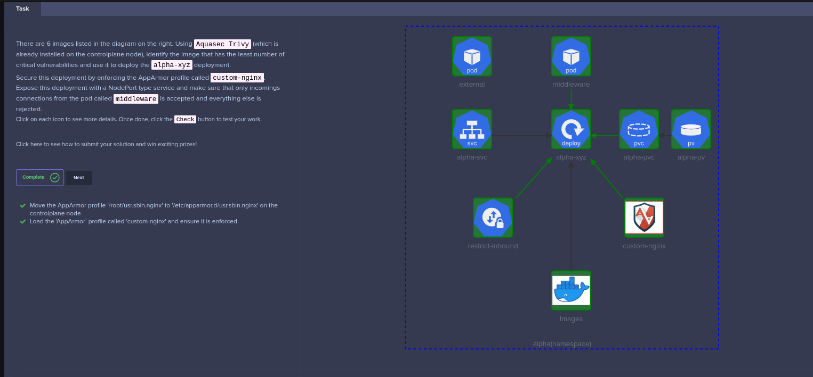

# KodeKloud CKS Challenge 01



## Scanning with Trivy  

Trivy uses advanced scanning technology such as vulnerability databases, security advisories, and Common Vulnerability Scoring System (CVSS) to identify potential security vulnerabilities on a range of targets.
It is capable of scanning a wide variety of targets, including container images, makes it a versatile and comprehensive security tool.

Here, we shall use a for loop to loop through the list of images, and find the image with least __CRITICAL__ vulnerability.

```shell
for image in nginx:alpine bitnami/nginx nginx:1.13 nginx:1.17 nginx:1.16 nginx:1.14 
  do 
    trivy image -s CRITICAL ${image} 
  done
```

## Setting up the AppArmor profile

AppArmor is a Linux security module that restricts an application's access to resources and actions beyond what is required for normal operation, reducing the attack surface of the application and mitigating potential security risks.

To set the AppArmor profile to be used in the `alpha-xyz` deployment,

```shell
# Inspect the app-armor profile to see if the profile name is correct
cat usr.sbin.nginx
# Then copy it to the default directory
cp usr.sbin.nginx /etc/apparmor.d/usr.sbin.nginx
# set the app-armor profile and verify it is loaded
apparmor_parser /etc/apparmor.d/usr.sbin.nginx
apparmor_status
```

## Troubleshooting the PersistentVolumeClaim (PVC)

Let's investigate the PersistentVolumeClaim, which have been created.

```shell
kubectl get pvc alpha-pvc -o wide
```

The PVC is not being bounded to the PersistanceVolume (PV), lets investigate further why.

```shell
kubectl get pvc alpha-pvc -o yaml
```

The issue is obvious that the `accessModes` is not match with the Persistance Volume.

```yaml
# REDACTED
spec:
  accessModes:
  - ReadWriteOnce
# REDACTED
```

Hence, the PVC definition needs to be updated.

```shell
# Grab the manifest for PVC
kubectl get pvc alpha-pvc -o yaml > alpha-pvc.yaml
```

### Updated PVC

```yaml
apiVersion: v1
kind: PersistentVolumeClaim
metadata:
  annotations:
    kubectl.kubernetes.io/last-applied-configuration: |
      {"apiVersion":"v1","kind":"PersistentVolumeClaim","metadata":{"annotations":{},"name":"alpha-pvc","namespace":"alpha"},"spec":{"accessModes":["ReadWriteOnce"],"resources":{"requests":{"storage":"1Gi"}},"storageClassName":"local-storage"}}
  creationTimestamp: "2023-05-08T10:43:22Z"
  finalizers:
  - kubernetes.io/pvc-protection
  name: alpha-pvc
  namespace: alpha
  resourceVersion: "7708"
  uid: 296fe5a1-36f5-4c6d-821f-8355d8c1a502
spec:
  accessModes:
  - ReadWriteMany
  resources:
    requests:
      storage: 1Gi
  storageClassName: local-storage
  volumeMode: Filesystem
status:
  phase: Pending
```

Then, the PVC should be replaced with the new definition

```shell
kubectl replace -f alpha-pvc.yaml --force
# Ensure the PVC is now bounded to the correct PV
kubectl get pvc alpha-pvc -o wide
```

## Deployment alpha-xyz

There are a couple things to be updated here,

1. Place the correct image name depending on the trivy scan. In this case `nginx:alpine` got the least number of __CRITICAL__ vulnerabilities
2. AppArmor profile should be set to `custom-nginx` for nginx container in the Deployment template
3. The `data-volume` should be mounted at `/usr/share/nginx/html`

Following is the completed manifest for the deployment.

```yaml
apiVersion: apps/v1
kind: Deployment
metadata:
  creationTimestamp: null
  labels:
    app: alpha-xyz
  name: alpha-xyz
  namespace: alpha
spec:
  replicas: 1
  selector:
    matchLabels:
      app: alpha-xyz
  strategy: {}
  template:
    metadata:
      creationTimestamp: null
      annotations:
        container.apparmor.security.beta.kubernetes.io/nginx: localhost/custom-nginx
      labels:
        app: alpha-xyz
    spec:
      volumes:
      - name: data-volume
        persistentVolumeClaim:
          claimName: alpha-pvc
      containers:
      - image: nginx:alpine
        name: nginx
        volumeMounts:
        - mountPath: "/usr/share/nginx/html"
          name: data-volume
```

Then the `alpha-xyz` can be deployed

```shell
kubectl apply -f /root/alpha-xyz.yaml
```

## Services

There are two services to be associated with `alpha-xyz` deployment

1. A NodePort service
2. A ClusterIP service (`alpha-svc`)

```shell
# ClusterIP Service
kubectl expose deployment alpha-xyz --port=80 --target-port=80 --name alpha-svc
# NodePort Service
kubectl expose deployment alpha-xyz --type NodePort --port=80
```

## Network Policies

The network policy is straightforward, only need to consider the ingress traffic to the `alpha-xyz` deployment

First, get the labels from  the `middleware` pod, so it can be used as in the `podSelector.matchLabels`

```shell
kubectl get pods middleware -o wide --show-labels 
```

Lets create the NetworkPolicy for `alpha-xyz` deployment

```yaml
apiVersion: networking.k8s.io/v1
kind: NetworkPolicy
metadata:
  name: restrict-inbound
  namespace: alpha
spec:
  podSelector:
    matchLabels:
      app: alpha-xyz
  policyTypes:
    - Ingress
  ingress:
  - from
      - podSelector:
          matchLabels:
            app: middleware
    ports:
      - protocol: TCP
        port: 80
```

Once the  NetworkPolicy get deployed, to verify the policy

```shell
kubectl describe networkpolicies.networking.k8s.io
```

## Smoke testing

The connectivity can be tested

```shell
# Should be failed
kubectl exec -it external -- curl alpha-svc
# Should be success
kubectl exec -it middleware -- curl alpha-svc
```
