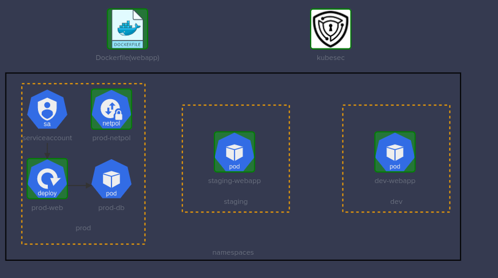

# KodeKloud CKS Challenge 02



## Securing the Docker image

Lets create the asserts directory to be used during the image build

```shell
cd webapp/
mkdir app
mv -f app.py requirements.txt templates app/
```

Then it is required to update the Dockerfile with following changes

1. remove the port 22 as it is not required
2. change the source directory in the `COPY` command
3. set correct `user`

 See the updated Dockerfile

```Dockerfile
FROM python:3.6-alpine

## Install Flask
RUN pip install flask

## Copy All files to /opt
COPY app/ /opt/

## Flask app to be exposed on port 8080
EXPOSE 8080

## Flask app to be run as 'worker'
RUN adduser -D worker

WORKDIR /opt

USER worker

ENTRYPOINT ["python", "app.py"]
```

Afterwards, it is required build the image

```shell
 # Build the docker image
 docker build -t kodekloud/webapp-color:stable .
 # Smoke testing
 docker run -dt kodekloud/webapp-color:stable
```

## Securing the Kubernetes manifest files
  
Lets run the `kubesec` on both the manifest files, to see if there are any critical concerns,
  
## dev-webapp

```shell
kubesec scan /root/dev-webapp.yaml
```

```json
[
  {
    "object": "Pod/dev-webapp.dev",
    "valid": true,
    "fileName": "/root/dev-webapp.yaml",
    "message": "Failed with a score of -34 points",
    "score": -34,
    "scoring": {
      "critical": [
        {
          "id": "CapSysAdmin",
          "selector": "containers[] .securityContext .capabilities .add == SYS_ADMIN",
          "reason": "CAP_SYS_ADMIN is the most privileged capability and should always be avoided",
          "points": -30
        },
        {
          "id": "AllowPrivilegeEscalation",
          "selector": "containers[] .securityContext .allowPrivilegeEscalation == true",
          "reason": "",
          "points": -7
        }
      ],
      "passed": [# REDACTED],
      "advise":  [# REDACTED]
    }
  }
]
```

`kubsec` has flagged two concerns here

1. `CapSysAdmin`
2. `AllowPrivilegeEscalation`

The fixes are straightforward, it is required to remove the `CapSysAdmin` capability from the container and set `AllowPrivilegeEscalation` to `false`

Here is the updated pod definition.  
*Note that the container image has been updated to `kodekloud/webapp-color:stable`*

```yaml
apiVersion: v1
kind: Pod
metadata:
  labels:
    name: dev-webapp
  name: dev-webapp
  namespace: dev
spec:
  containers:
  - env:
    - name: APP_COLOR
      value: darkblue
    image: kodekloud/webapp-color:stable
    imagePullPolicy: Never
    name: webapp-color
    resources: {}
    securityContext:
      runAsUser: 0
      allowPrivilegeEscalation: false
      capabilities:
        add:
        - NET_ADMIN
      # REDACTED
```

Now, lets re run the `kubesec scan` to see if the issues has been fixed

```json
[
  {
    "object": "Pod/dev-webapp.dev",
    "valid": true,
    "fileName": "/root/dev-webapp.yaml",
    "message": "Passed with a score of 3 points",
    "score": 3,
    "scoring": {
      "passed": [# REDACTED],
      "advise": [# REDACTED]
    }
  }
]
```

Now it is safe to redeploy the pod.

```shell
kubectl replace -f /root/dev-webapp.yaml --force
```

## staging-webapp

```shell
kubesec scan /root/staging-webapp.yaml
```

```json
[
  {
    "object": "Pod/staging-webapp.staging",
    "valid": true,
    "fileName": "/root/staging-webapp.yaml",
    "message": "Failed with a score of -34 points",
    "score": -34,
    "scoring": {
      "critical": [
        {
          "id": "CapSysAdmin",
          "selector": "containers[] .securityContext .capabilities .add == SYS_ADMIN",
          "reason": "CAP_SYS_ADMIN is the most privileged capability and should always be avoided",
          "points": -30
        },
        {
          "id": "AllowPrivilegeEscalation",
          "selector": "containers[] .securityContext .allowPrivilegeEscalation == true",
          "reason": "",
          "points": -7
        }
      ],
      "passed": [# REDACTED],
      "advise": [# REDACTED]
    }
  }
]
```

Same as the dev-webapp, `kubesec` has flagged two concerns here

1. `CapSysAdmin`
2. `AllowPrivilegeEscalation`

The fixed is trivial, it is required to remove the `CapSysAdmin` capability from the container and set `AllowPrivilegeEscalation` to `false`

Here is the updated pod definition.  
*Note that the container image has been updated to `kodekloud/webapp-color:stable`*

```yaml
apiVersion: v1
kind: Pod
metadata:
  labels:
    name: staging-webapp
  name: staging-webapp
  namespace: staging
spec:
  containers:
  - env:
    - name: APP_COLOR
      value: pink
    image: kodekloud/webapp-color:stable
    imagePullPolicy: Never
    name: webapp-color
    resources: {}
    securityContext:
      allowPrivilegeEscalation: false
      runAsUser: 0
      capabilities:
        add:
        - NET_ADMIN
    # REDACTED
```

Now, lets re run the `kubesec scan` to see if the issues has been fixed

```shell
kubesec scan /root/staging-webapp.yaml
```

```json
[
  {
    "object": "Pod/staging-webapp.staging",
    "valid": true,
    "fileName": "/root/staging-webapp.yaml",
    "message": "Passed with a score of 3 points",
    "score": 3,
    "scoring": {
      "passed": [
        {
          "id": "ServiceAccountName",
          "selector": ".spec .serviceAccountName",
          "reason": "Service accounts restrict Kubernetes API access and should be configured with least privilege",
          "points": 3
        }
      ],
      "advise": [# REDACTED]
    }
  }
]
```

Now it is safe to redeploy the pod.

```shell
kubectl replace -f /root/dev-webapp.yaml --force
```

## Removing the shell(s) from the container

Here, there are two binaries to be deleted during the pod startup,

1. `sh`
2. `ash`

To achieve that during the pod startup, following configurations should be included to the both pods (`staging-webapp` and `dev-webapp`)

```yaml
startupProbe:
  exec:
    command:
    - rm
    - -f
    - /bin/sh
    - /bin/ash
  initialDelaySeconds: 5
  periodSeconds: 5
```

Once both the manifests are updated, lets deploy the pods,

```shell
kubectl replace -f /root/dev-webapp.yaml --force
kubectl replace -f /root/staging-webapp.yaml --force
```

## Using Kubernetes secrets as environments variable

First, lets grab the environment variables from the deployment

```shell
kubectl get deployments.apps -n prod  -o yaml
```

*Note that you can try using `jsonpath` to grab those environment variable* [see](https://kubernetes.io/docs/reference/kubectl/jsonpath/).

```yaml
apiVersion: apps/v1
kind: Deployment
# REDACTED
spec:
  # REDACTED
  template:
    metadata:
      # REDACTED
    spec:
      containers:
      - env:
        - name: DB_Host
          value: prod-db
        - name: DB_User
          value: root
        - name: DB_Password
          value: paswrd
        # REDACTED
  ```
  
 Now lets create the secret with the above values,

```shell
kubectl create secret generic prod-db \
--from-literal DB_Host=prod-db \
--from-literal DB_User=root \
--from-literal DB_Password=paswrd \
-n prod 
```

Now lets update the deployments to refer to the environment variable from the `prod-db` secret

```yaml
apiVersion: apps/v1
kind: Deployment
metadata:
  # REDACTED
spec:
  # REDACTED
  template:
      # REDACTED
    spec:
      containers:
      - envFrom:
          - secretRef:
              name: prod-db
        name: test-secret
        image: mmumshad/simple-webapp-mysql
        imagePullPolicy: Always
        name: webapp-mysql
        ports:
        - containerPort: 8080
          protocol: TCP
        # REDACTED
```

## NetworkPolicy

There are a couple of things should be highlighted,

- the policy type, which is `ingress`  
- as this policy should be applied to all the pods in the namespace,
  - `podSelector: {}`
- the ports, which should be supposed to server the traffics.  
  - 8080
  - 3036  
- and the whitelisted namespace, which is `prod`

So first, lets see what are the existing labels attached to `prod` namespace.

```shell
kubectl get ns prod --show-labels 
NAME   STATUS   AGE   LABELS
prod   Active   64m   kubernetes.io/metadata.name=prod
```

Since all the data required to create the NetworkPolicy is in hand, lets create the NetworkPolicy file, and get it created.

```yaml
apiVersion: networking.k8s.io/v1
kind: NetworkPolicy
metadata:
  name: prod-netpol
  namespace: prod
spec:
  podSelector: {}
  ingress:
  - from:
        - namespaceSelector:
            matchLabels:
              kubernetes.io/metadata.name: prod
  policyTypes:
  - Ingress
      - protocol: TCP
        port: 3306          
      - protocol: TCP
        port: 8080
 ```
