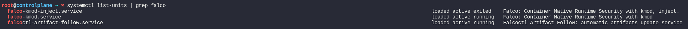

# KodeKloud CKS Challenge 04


This challenge focused on how to analysis/audit suspicious behaviors using, using Falco and Kubernetes auditing.

*Please note that the grading system has not picked the installed version of Falco, hence the Task is marked as incomplete.*

According to the Falco documentations, there have been recent change to the systemd unit names. See [here](https://falco.org/docs/getting-started/installation/#falco-packages).

## Install and configure Falco

Falco is a software tool that monitors and alerts on activities that involve making system calls in a Linux operating system.
It uses a combination of user space and kernel space modules to monitor and analyze the system calls made by processes on the system.

Falco is capable of identifying specific system calls, arguments, and properties of the calling process, and uses a rules engine to filter and alert on suspicious events.
When such events are detected, Falco can be configured to notify various outputs, such as Syslog, files, or Standard Output, so that security teams or system administrators
can investigate and take appropriate action.

The installation is straightforward, here I have used `Kmod` as the preferred plugin to install.

### Installation

Following installation steps are directly copied from the official Falco documentation, it is recommended to refer to the documentation, if you wish to install Falco in your system.

```shell
# Trust the falcosecurity GPG key
curl -fsSL https://falco.org/repo/falcosecurity-packages.asc | \
  sudo gpg --dearmor -o /usr/share/keyrings/falco-archive-keyring.gpg

# Configure the apt repository
sudo cat >>/etc/apt/sources.list.d/falcosecurity.list <<EOF
deb [signed-by=/usr/share/keyrings/falco-archive-keyring.gpg] https://download.falco.org/packages/deb stable main
EOF

# Update the package list
sudo apt-get update -y

# Install some required dependencies that are needed to build the kernel module and the BPF probe
sudo apt install -y dkms make linux-headers-$(uname -r)
# If you use the falco-driver-loader to build the BPF probe locally you need also clang toolchain
sudo apt install -y clang llvm
# You can install also the dialog package if you want it
sudo apt install -y dialog

# Install the Falco package
sudo apt-get install -y falco
```

The driver, I have associated in this scenario is `kmod`, and I have enabled the automatic rule-sets update.

See [here](https://falco.org/docs/getting-started/installation/#installation-details) for the complete installation guide.

Once installed, we can list Falco systemd services as below



Once it is verified that Falco is running, we might need to update it to log the events in `/opt/falco.log`.

Following config needs to be updated in `/etc/falco/falco.yaml`

```yaml
file_output:
  enabled: true
  keep_alive: false
  filename: /opt/falco.log
```

Once done, we can restart the falco service,

```shell
systemctl restart falco
```

To verify if Falco is writing the logs under `/opt/falgo.log`,

```shell
root@controlplane ~ ➜  tail /opt/falco.log 
04:50:46.879494591: Error Package management process launched in container (user=root user_loginuid=-1 # REDACTED
04:51:02.150123544: Error Package management process launched in container (user=root user_loginuid=-1 # REDACTED 
04:51:27.142434942: Error Package management process launched in container (user=root user_loginuid=-1 # REDACTED
04:51:47.137437708: Error Package management process launched in container (user=root user_loginuid=-1 # REDACTED
```

## Configure Kubernetes Auditing

Though the following statement is a bit vague to me when I was read it for the first time, we can get the gist of it.

*Create a single rule in the audit policy that will record events for the 'two' objects depicting abnormal behaviour in the 'citadel' namespace.
This rule should however be applied to all 'three' namespaces shown in the diagram at a 'metadata' level. Omit the 'RequestReceived' stage.*

So if we refer to the objects in `citadel` namespace, it is clear that,

- `configmap` webapp-config-map
- `pod` webapp-color

are keep replacing. So the two object types that mention above are `configmaps` and `pods`.

Secondly, the audit rule should only focus on `omega`, `citadel` and `eden-prime` namespaces in `metadata` level.

See below auditing policy.

```yaml
# /etc/kubernetes/audit-policy.yaml 
apiVersion: audit.k8s.io/v1 # This is required.
kind: Policy
omitStages:
  - "RequestReceived"
rules:
  - level: Metadata
    resources:
    - group: ""
      # Resource "pods" doesn't match requests to any subresource of pods,
      # which is consistent with the RBAC policy.
      resources: ["pods", "configmaps"]
    namespaces: ["omega", "citadel", "eden-prime"]
```

Before we started to change the API server configuration, lets provision a directory for the Audit logs.

```shell
mkdir -p /var/log/kubernetes/audit/
```

### Kube API Server configuration

Update the following configuration in the kube-apiserver manifest file in `/etc/kubernetes/manifests/kube-apiserver.yaml`

First, lets configure the volumes and volume mounts

Then we can update `kube-apiserver` arguments enable auditing.

*Below manifest file only highlights the intended configurations*

```yaml
apiVersion: v1
kind: Pod
metadata:
  # REDACTED
  name: kube-apiserver
  namespace: kube-system
spec:
  containers:
  - command:
    - kube-apiserver
    - --audit-policy-file=/etc/kubernetes/audit-policy.yaml
    - --audit-log-path=/var/log/kubernetes/audit/audit.log
    # REDACTED
    name: kube-apiserver
    volumeMounts:
    # REDACTED
    - mountPath: /etc/kubernetes/audit-policy.yaml
      name: audit
      readOnly: true  
    - mountPath: /var/log/kubernetes/audit/
      name: audit-log
      readOnly: false
  # REDACTED
  volumes:
  - name: audit
    hostPath:
      path: /etc/kubernetes/audit-policy.yaml
      type: File
  - name: audit-log
    hostPath:
      path: /var/log/kubernetes/audit/
      type: DirectoryOrCreate
# REDACTED
status: {}
```

## Monitoring

As both the Kubernetes auditing and Falco monitoring has been set up, we can investigate the suspicious behaviours.

### Kubernetes Audit logs

Here is a sample of the audit log,

```shell
tail /var/log/kubernetes/audit/audit.log | jq
```

```json
{
  "kind": "Event",
  "apiVersion": "audit.k8s.io/v1",
  "level": "Metadata",
  "auditID": "c59aa70d-a830-4c23-9d67-0f37844a4cfc",
  "stage": "ResponseComplete",
  "requestURI": "/api/v1/namespaces/citadel/pods?fieldManager=kubectl-create",
  "verb": "create",
  "user": {
    "username": "kubernetes-admin",
    "groups": [
      "system:masters",
      "system:authenticated"
    ]
  },
  "impersonatedUser": {
    "username": "agent-smith",
    "groups": [
      "system:authenticated"
    ]
  },
  "sourceIPs": [
    "192.168.121.1"
  ],
  "userAgent": "kubectl/v1.20.0 (linux/amd64) kubernetes/af46c47",
  "objectRef": {
    "resource": "pods",
    "namespace": "citadel",
    "name": "webapp-color",
    "apiVersion": "v1"
  },
  "responseStatus": {
    "metadata": {},
    "code": 201
  },
  "requestReceivedTimestamp": "2023-05-14T04:43:42.223786Z",
  "stageTimestamp": "2023-05-14T04:43:42.229044Z",
  "annotations": {
    "authorization.k8s.io/decision": "allow",
    "authorization.k8s.io/reason": "RBAC: allowed by RoleBinding \"important_binding_do_not_delete/citadel\" of Role \"important_role_do_not_delete\" to User \"agent-smith\"",
    "pod-security.kubernetes.io/enforce-policy": "privileged:latest"
  }
}
```

The first clue to solve this (at least to me) was above recurring event, which explain why the `webapp-color` pod keep changing.

So the culprit is `agent-smith`, lets delete both the role and role-binding, which allow this user to perform this.

```shell
# To get the role and role-binding
root@controlplane ~ ➜  kubectl get rolebindings.rbac.authorization.k8s.io  -o wide -n citadel
NAME                              ROLE                                AGE   USERS          GROUPS   SERVICEACCOUNTS
dev1                              Role/dev1                           50m   dev-user                
important_binding_do_not_delete   Role/important_role_do_not_delete   50m   agent-smith             
important_citadel_user_binding    Role/important_citadel_user_role    50m   citadel-user         
```

```shell
# Delete the role
kubectl delete role important_role_do_not_delete  -n citadel
# Delete the role-binding
kubectl delete rolebindings.rbac.authorization.k8s.io important_binding_do_not_delete  -n citadel
```

### Falco events

Let's investigate Falco events in `/opt/falco.logs`

```shell
root@controlplane ~ ➜  tail /opt/falco.log 
04:50:46.879494591: Error Package management process launched in container (user=root user_loginuid=-1 command=apt install nginx pid=27616 container_id=8bfd921f6a90 container_name=k8s_eden-software2_eden-software2_eden-prime_c62cd7c1-37c2-47cc-88d6-cbf4434f480b_0 image=ubuntu:latest)
04:51:02.150123544: Error Package management process launched in container (user=root user_loginuid=-1 command=apt install nginx pid=27799 container_id=8bfd921f6a90 container_name=k8s_eden-software2_eden-software2_eden-prime_c62cd7c1-37c2-47cc-88d6-cbf4434f480b_0 image=ubuntu:latest)
04:51:27.142434942: Error Package management process launched in container (user=root user_loginuid=-1 command=apt install nginx pid=28557 container_id=8bfd921f6a90 container_name=k8s_eden-software2_eden-software2_eden-prime_c62cd7c1-37c2-47cc-88d6-cbf4434f480b_0 image=ubuntu:latest)
04:51:47.137437708: Error Package management process launched in container (user=root user_loginuid=-1 command=apt install nginx pid=29039 container_id=8bfd921f6a90 container_name=k8s_eden-software2_eden-software2_eden-prime_c62cd7c1-37c2-47cc-88d6-cbf4434f480b_0 image=ubuntu:latest)
04:52:01.398472097: Error Package management process launched in container (user=root user_loginuid=-1 command=apt install nginx pid=29254 container_id=8bfd921f6a90 container_name=k8s_eden-software2_eden-software2_eden-prime_c62cd7c1-37c2-47cc-88d6-cbf4434f480b_0 image=ubuntu:latest)
04:52:26.403328190: Error Package management process launched in container (user=root user_loginuid=-1 command=apt install nginx pid=30042 container_id=8bfd921f6a90 container_name=k8s_eden-software2_eden-software2_eden-prime_c62cd7c1-37c2-47cc-88d6-cbf4434f480b_0 image=ubuntu:latest)
04:52:46.383109164: Error Package management process launched in container (user=root user_loginuid=-1 command=apt install nginx pid=30503 container_id=8bfd921f6a90 container_name=k8s_eden-software2_eden-software2_eden-prime_c62cd7c1-37c2-47cc-88d6-cbf4434f480b_0 image=ubuntu:latest)
04:53:01.663770736: Error Package management process launched in container (user=root user_loginuid=-1 command=apt install nginx pid=30696 container_id=8bfd921f6a90 container_name=k8s_eden-software2_eden-software2_eden-prime_c62cd7c1-37c2-47cc-88d6-cbf4434f480b_0 image=ubuntu:latest)
04:53:26.675809498: Error Package management process launched in container (user=root user_loginuid=-1 command=apt install nginx pid=31525 container_id=8bfd921f6a90 container_name=k8s_eden-software2_eden-software2_eden-prime_c62cd7c1-37c2-47cc-88d6-cbf4434f480b_0 image=ubuntu:latest)
04:53:46.659625483: Error Package management process launched in container (user=root user_loginuid=-1 command=apt install nginx pid=32016 container_id=8bfd921f6a90 container_name=k8s_eden-software2_eden-software2_eden-prime_c62cd7c1-37c2-47cc-88d6-cbf4434f480b_0 image=ubuntu:latest)
```

Here, the culprit is a container belongs to a pod in `eden-prime` namespace, so we have to terminate the pods.

The container name, according to the above logs is `container_name=k8s_eden-software2_eden-software2`

To terminate the specific pod

```shell
kubectl delete pod eden-software2 -n eden-prime
```

### Additional tasks

To finalise the task, lets dump the objects that are suspicious as requested by the task.

```shell
# Roles and RoleBinding
echo "agent-smith,important_role_do_not_delete,important_binding_do_not_delete" > /opt/blacklist_users
# Pods 
echo "eden-prime,eden-software2" > /opt/compromised_pods 
```
